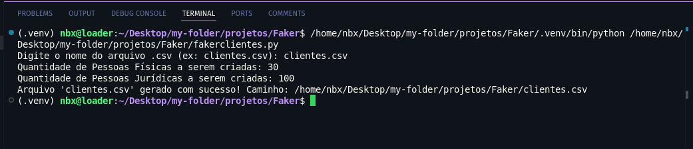
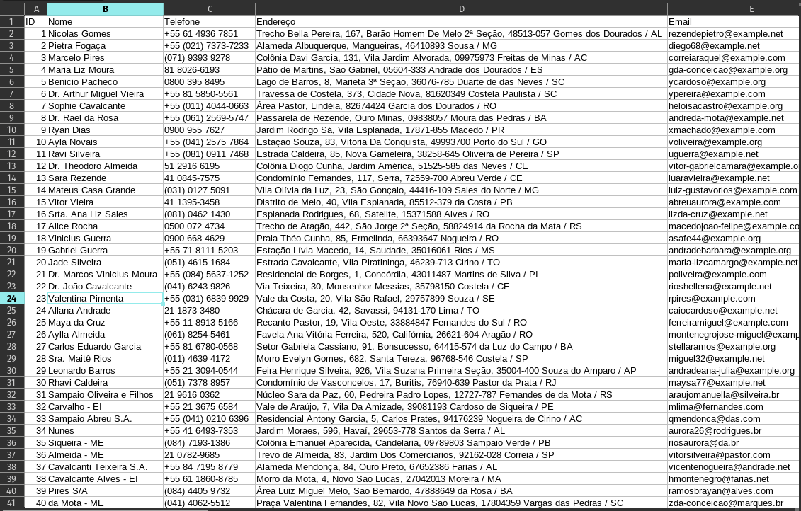

# Gerador de Dados Simulados para Prototipagem com Faker

Este repositório contém dois scripts em Python que utilizam a biblioteca [Faker](https://faker.readthedocs.io/) para gerar dados simulados em arquivos `.csv`. Esses dados são úteis para prototipagem de sistemas, especialmente na fase inicial de desenvolvimento.

## Scripts

1. **fakerclientes.py** - Gera uma lista de clientes simulados.
2. **fakerestoque.py** - Gera um estoque simulado de produtos.

### 1. fakerclientes.py

Este script gera dados simulados de clientes, podendo incluir tanto pessoas físicas quanto pessoas jurídicas.

#### Colunas no Arquivo `.csv`

- **ID**: Identificação única de cada cliente.
- **Nome**: Nome do cliente (ou nome da empresa para pessoas jurídicas).
- **Telefone**
- **Endereço**: Endereço completo.
- **Email**: Endereço de email.
- **Notas**: Campo vazio para observações futuras.
- **CPF**: Somente para pessoas físicas).
- **CNPJ**: Somente para pessoas jurídicas).
- **Cliente desde**: Data de entrada do cliente na empresa (formato MM-YYYY).
- **Pagamentos**: Tipo de pagamento (mensal ou diária).
- **Pagamento em dia**: Status do pagamento (em dia ou em atraso).

#### Como Usar

1. **Instale as dependências**:
   ```bash
   pip install Faker
   ```
2. **Execute o script**:
   ```bash
   python fakerclientes.py
   ```
3. **Siga as instruções** para inserir o nome do arquivo de saída e a quantidade de clientes a serem gerados.

### 2. fakerestoque.py

Este script gera dados simulados para um estoque de produtos.

#### Colunas no Arquivo `.csv`

- **ID**: Identificação única de cada produto.
- **Nome do Produto**: Nome do produto.
- **Categoria**: Categoria a qual o produto pertence.
- **Quantidade em Estoque**: Quantidade disponível do produto.
- **Preço (R$)**: Preço unitário do produto em reais.
- **Data de Adição**: Data em que o produto foi adicionado ao estoque (formato DD-MM-YYYY).
- **Fornecedor**: Nome do fornecedor.

#### Como Usar

1. **Instale as dependências**:
   ```bash
   pip install Faker
   ```
2. **Execute o script**:
   ```bash
   python fakerestoque.py
   ```
3. **Siga as instruções** para inserir o nome do arquivo de saída e a quantidade de produtos a serem gerados.

## Exemplo de Saída

1. **Exemplo da saída no terminal**:

   

2. **Exemplo do arquivo `.csv` gerado**:

   

## Estrutura do `.gitignore`

O arquivo `.gitignore` está configurado para excluir arquivos de ambiente virtual (`.venv`), arquivos de lock temporários, e todos os arquivos `.csv`, garantindo que somente os scripts sejam enviados para o repositório.

## Autor

Desenvolvido por [92username](https://github.com/92username).

